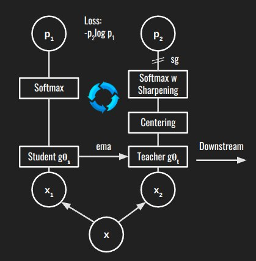
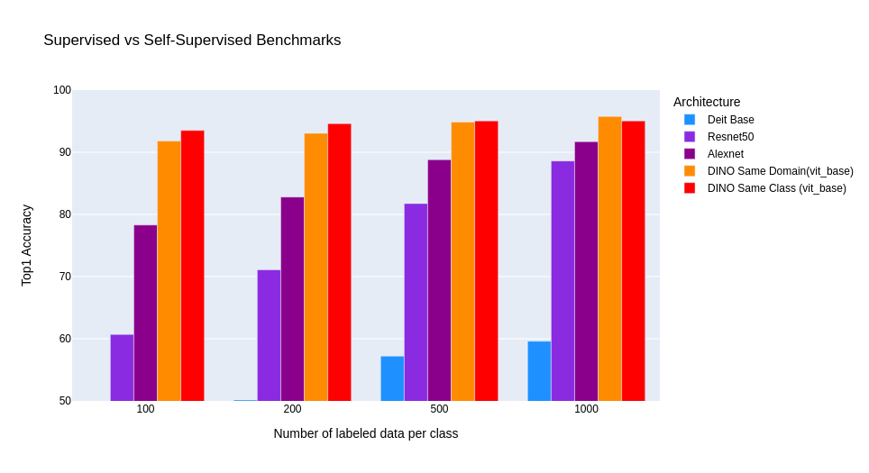
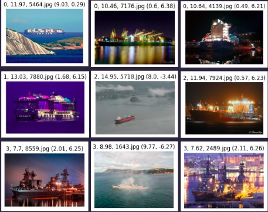
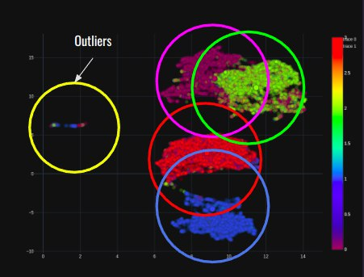

# DINO Self Distillation with No Labels

## Exploring state-of-the-art Self-Supervised Learning for image classification

This project is an example built experimenting with Self-Supervised Learning and showing the potential and viability of the methodology. In this project, the following items are covered:
* Setting up a Pytorch environment that supports DINO
* Generating a custom Pytorch Dataset class
* Script examples to train and evaluate the DINO model
* Couple notebooks to analyze the results such as UMAPs, different number of labeled data/class, experiements
* Potential anamoly detection in dataset

## DINO Architecture


## How to install this example project

1. Clone this project
2. See Docker environment setup
3. Training the model
4. Evaluating the mode

## Docker Environment Setup 
### Build the docker image
```Bash
cd Docker
docker build -t pytorch_1.12.1 -f pytorch.Dockerfile .
```

### Running the environment
```Bash
./run_pytorch.sh
```

## Trainig the model
1. Preparing your dataset
To train a Self-Supervised model, an additional section should be made on top of the traditional "train, validation, test" split.<br/>
Create an additional folder called pretext in your data folder, this set of images need not be grouped into classes will be used for during the pretext training.

### Example
```
data 
│
└── MyDataset
│  │
│  └─── pretext
│      │   Image1.jpg
│      │   Image2.jpg
│      │   ...
│  │
│  └─── train
|      |
|      └─── Class1
|          | Image3.jpg
|          | Image4.jpg
│          │   ...
|      |
|      └─── Class2
|          | Image3.jpg
|          | Image4.jpg
│          │   ...
│  │
│  └─── val
|      |
|      └─── Class1
|          | Image3.jpg
|          | Image4.jpg
│          │   ...
|      |
|      └─── Class2
|          | Image3.jpg
|          | Image4.jpg
│          │   ...
```

2. Running the training script (From DINO folder)
``` Bash
python main_dino.py \
	--arch <vit_tiny / vit_small / vit_base> \
	--epochs <NUM_EPOCHS> \
	--data_path <PATH_TO_DATASET> \
	--saveckp_freq <SAVE_FREQ> \
	--batch_size_per_gpu <BATCH_SIZE> \
	--num_workers <NUM_WORKERS>
```

### Alternatively, DINO is trainable with Resnet instead of ViT
```Bash
python main_dino.py \
	--arch resnet50 \
	--optimizer sgd \
	--weight_decay 1e-4 \
	--lr 0.03 \
	--weight_decay_end 1e-4 \
	--global_crops_scale 0.14 1 \
	--local_crops_scale 0.05 0.14 \
	--epochs 800 \
	--data_path <PATH_TO_DATA> \
	--saveckp_freq <SAVE_FREQ> \
	--batch_size_per_gpu <BATCH_SIZE> \
	--num_workers <NUM_WORKERS>
```

## Evaluating the model
### Linear Evaluation
\* Make sure there is a train and val folder in dataset folder.
``` Bash
python eval_linear.py \
	--arch <vit_tiny / vit_small / vit_base> \
	--pretrained_weights <PATH_TO_CHECKPOINT> \
	--num_workers <NUM_WORKERS> \
	--val_freq <VAL_FREQ> \
	--batch_size_per_gpu <BATCH_SIZE> \
	--epochs <EPOCHS> \
	--data_path <PATH_TO_DATA> \
	--num_labels <NUM_CLASSES>
```

### k-NN Evaluation
```Bash
python eval_linear.py \
	--arch <vit_tiny / vit_small / vit_base> \
	--pretrained_weights <PATH_TO_CHECKPOINT> \
	--num_workers <NUM_WORKERS> \
	--val_freq <VAL_FREQ> \
	--batch_size_per_gpu <BATCH_SIZE> \
	--epochs <EPOCHS> \
	--data_path <PATH_TO_FOLDER> \
	--num_labels <NUM_CLASSES>
```

## Performance Benchmark
Experiements are done to evaluate how well the DINO model performs when given extremely limited labeled images during the downstream, graph below shows the DINO model against various common Supervised Models. Each benchmark is trained on X labeled images and ran for 100 epochs.

### Experiment 1
<b>Same Class Dataset<b>
Classes for images used for pretext task are the same as for the downstream task
~ 16,000 images (4000 x 4 classes)

### Experiment 2
<b>Same Domain Dataset<b>
Images used for pretext task are the in the same category but not the target classes as for the downstream task
~ 77,000 images across 14 seperate classes



## Bad training data detection/anamoly (In Progress)
When graphing the UMAP of the pretext trained model, it is observed that there is a group of outliers, upon further inspection, these outliers are images that are really hard to classify. Further intervention could be done to improve the training, evaluation of this method. <br/>




## Known isseus (Work in Progress)
None as of initial commit

## Links to related projects
Supervised Learning Benchmarks [[Github]](https://github.com/shaunyuencw/CV_Supervised)<br/>
SimCLR experiment [[Github]](https://github.com/shaunyuencw/SimCLR)

## Download Links to Dataset and Checkpoint Weights
[Dataset](https://drive.google.com/file/d/16JvLoYBy6f65uCsJkbjiZWLOuV2J3hVe/view?usp=share_link)<br>
[Model Checkpoints](https://drive.google.com/drive/folders/14Kuljh7nrNAXj_RP9fF_i0Nzcz39Wwd7?usp=share_link)
\*Ship Experiment refers to Same Class Pretext Training

## References
Emerging Properties in Self-Supervised Vision Transformers 
[[arXix]](https://arxiv.org/abs/2104.14294) [[Github]](https://github.com/facebookresearch/dino)